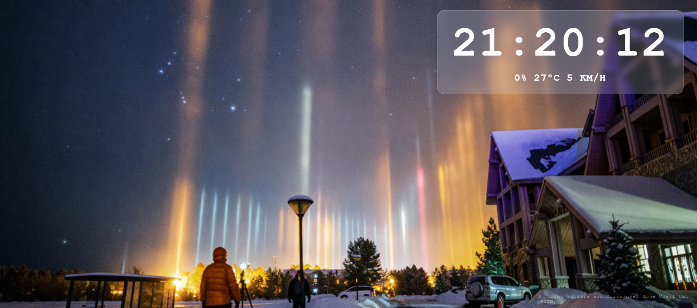

# NASA API

A smart browser homepage that pulls the latest 7 images from NASA and smoothly fades between them every 8 seconds.

Top-right: live clock + local weather
Bottom-left: random quote (refreshes on each new tab)

# Preview

## What it does

- Shows today's NASA Astronomy Picture of the Day as the background
- Live clock that ticks every second
- Local weather (temperature, rain chance, wind speed) using your location
- Random quote that changes every time you open the tab

## How I made it

Plain HTML, CSS, and JavaScript — no frameworks, no libraries, just the basics.

APIs used:
- [NASA APOD](https://api.nasa.gov) — daily space photo background
- [Open-Meteo](https://open-meteo.com) — weather, no key needed
- [Quotable](https://api.quotable.io) — random quotes, no key needed

## How to try it

1. Download or clone this repo
2. Open `index.html` in any browser
3. Allow location access when the browser asks (for weather)

